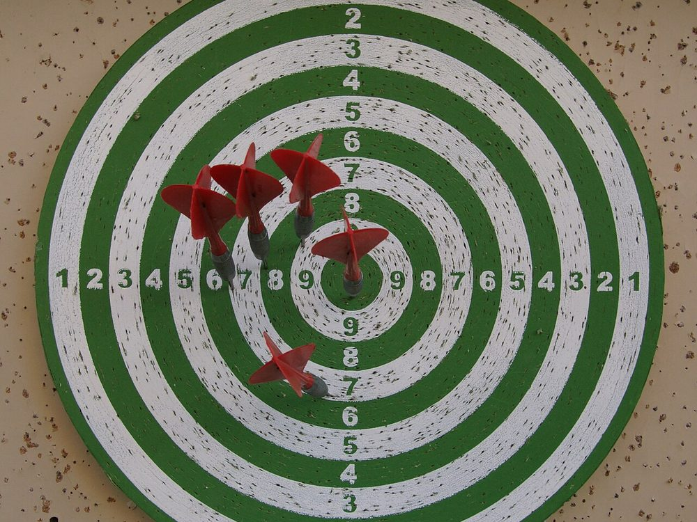
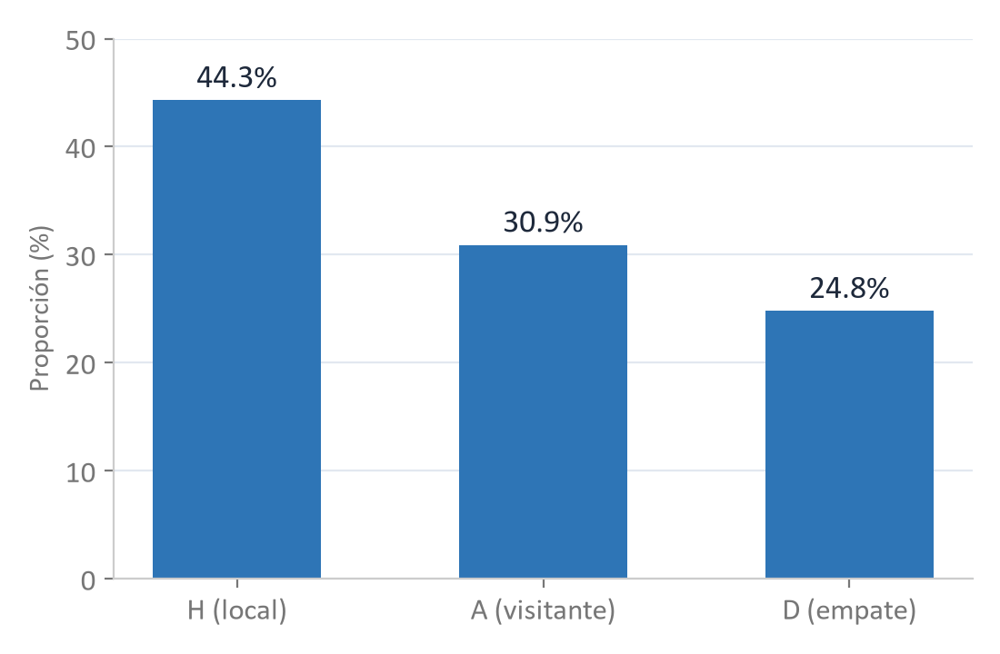
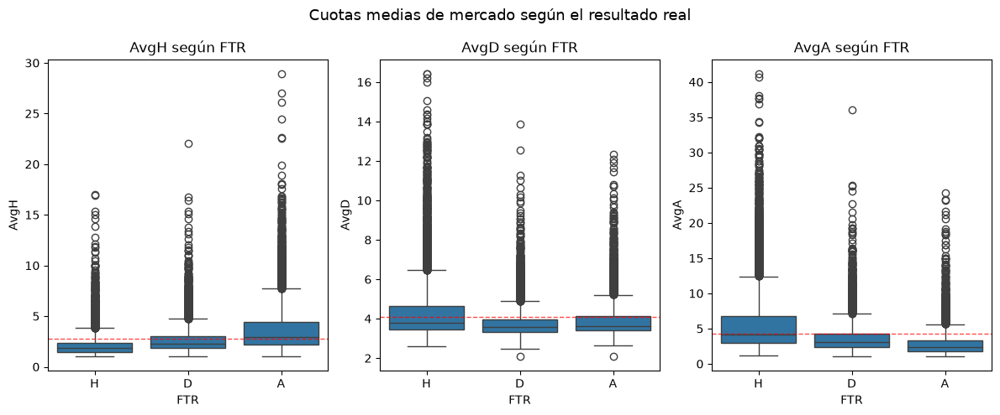
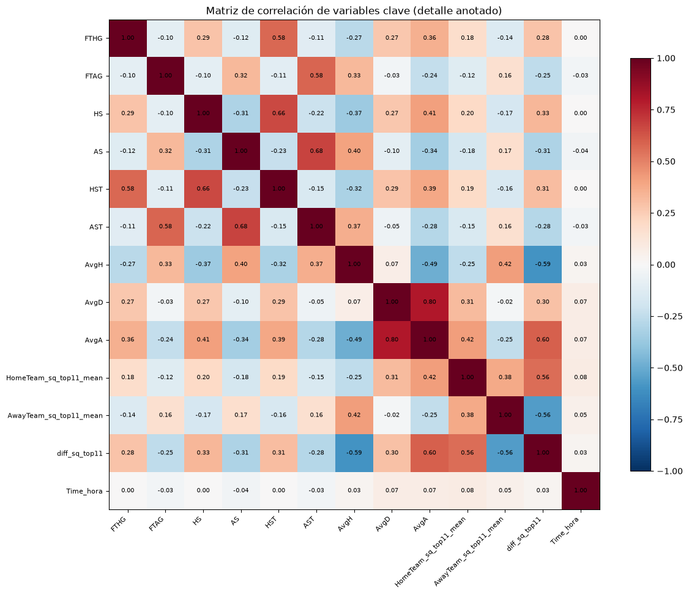
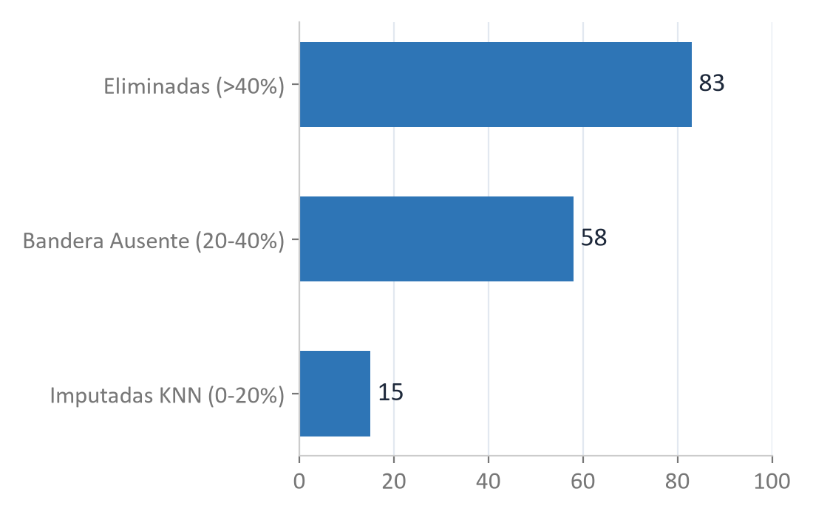
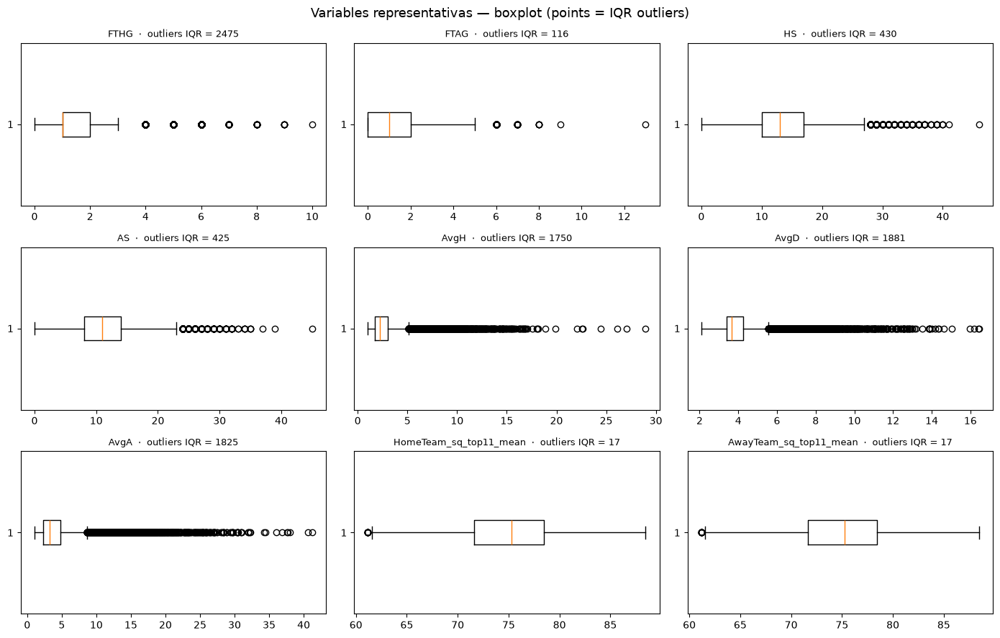

<!-- _class: dark -->
<!-- _paginate: false -->

¿Se pueden estimar probabilidades 1X2 bien calibradas para un mercado de apuestas de fútbol altamente eficiente?

Etapa 1 (P1) — Problema, Dataset y Análisis Exploratorio de Datos

José Luis Alva Espinoza &nbsp;·&nbsp; Juan Carlos Ticlia Maqui &nbsp;·&nbsp; Elmer José Villegas Suárez &nbsp;·&nbsp; Joseph Anderson Cose Rojas Departamento de Computación — Universidad de Ingeniería y Tecnología (UTEC), Lima, Perú

Septiembre 2026

---

Un mercado de apuestas eficiente solo se puede superar con probabilidades calibradas, no con más aciertos

<ul style="margin:0; padding-left:20px;"><li style="margin-bottom:16px;">Fútbol: pocos goles, azar alto, fuerte efecto de contexto.</li><li style="margin-bottom:16px;">Techo empírico: ~55% de acierto en la clase ganadora.</li><li style="margin-bottom:16px;">Mercado de apuestas altamente eficiente — las cuotas ya condensan la información pública.</li><li style="margin-bottom:16px;">ML solo aporta valor con probabilidades bien calibradas.</li></ul>

Estadio de fútbol — Wikimedia Commons (CC0)

Tammouch, Elouafi &amp; Essadik (2024); Knoll &amp; Stübinger (2020)

---

El objetivo: predecir 1X2 con probabilidades calibradas usando solo datos pre-partido

Dado un partido con local H y visitante A, estimar P(FTR = c | x) para c ∈ {H, D, A}, donde x agrupa forma reciente, calidad de plantilla, localía y cuotas pre-partido.

Hipótesis de trabajo

<ul style="margin:0; padding-left:20px;"><li style="margin-bottom:8px;">Las cuotas de mercado dominan sobre las features estadísticas individuales.</li><li style="margin-bottom:8px;">La calidad de plantilla aporta señal complementaria, sobre todo al inicio de temporada.</li><li style="margin-bottom:8px;">Un modelo mal calibrado puede acertar más pero perder dinero en el backtest.</li></ul>

---

La tarea es clasificación multiclase probabilística; log loss y Brier score priman sobre accuracy

Tarea de ML

<ul style="margin:0; padding-left:20px;"><li style="margin-bottom:8px;">Multiclase (3 clases), salida probabilística.</li><li style="margin-bottom:8px;">Métrica primaria: log loss.</li><li style="margin-bottom:8px;">Complementarias: accuracy, F1, Brier, reliability diagrams.</li></ul>

Cuota → probabilidad

p_c = (1/o_c) / Σ_j (1/o_j)  Value bet si p̂ · o &gt; 1.

El edge puede aparecer en local, empate o visitante — no solo en el favorito.

Dardos — kallerna, Wikimedia Commons (CC BY-SA 3.0)

---

Construimos un dataset propio de 30,182 partidos combinando cuotas de mercado y calidad de plantilla

Fuentes

<ul style="margin:0; padding-left:20px;"><li style="margin-bottom:8px;"><b>football-data.co.uk: </b>90 CSVs, 9 ligas, 10 temporadas.</li><li style="margin-bottom:8px;"><b>Kaggle (FIFA/FC): </b>10 snapshots de ratings, proxy de plantilla.</li></ul>

Centro de datos — Wikimedia Commons (CC0)

Dataset consolidado

<table style="position:absolute; left:53.00%; top:30.22%; width:42.00%; height:46.22%; border-collapse:collapse; font-size:13px;"><tr><td style="padding:5px 8px; border:0.5px solid #CCCCCC;">Partidos</td><td style="padding:5px 8px; border:0.5px solid #CCCCCC; text-align:right;">30,182</td></tr><tr><td style="padding:5px 8px; border:0.5px solid #CCCCCC;">Columnas útiles</td><td style="padding:5px 8px; border:0.5px solid #CCCCCC; text-align:right;">219 (de 222)</td></tr><tr><td style="padding:5px 8px; border:0.5px solid #CCCCCC;">Ligas / Temporadas</td><td style="padding:5px 8px; border:0.5px solid #CCCCCC; text-align:right;">9 / 10</td></tr><tr><td style="padding:5px 8px; border:0.5px solid #CCCCCC;">Equipos</td><td style="padding:5px 8px; border:0.5px solid #CCCCCC; text-align:right;">280</td></tr><tr><td style="padding:5px 8px; border:0.5px solid #CCCCCC;">Cobertura squad quality</td><td style="padding:5px 8px; border:0.5px solid #CCCCCC; text-align:right;">97.1%</td></tr><tr><td style="padding:5px 8px; border:0.5px solid #CCCCCC;">Nulos tras limpieza</td><td style="padding:5px 8px; border:0.5px solid #CCCCCC; text-align:right;">0</td></tr></table>

Clave compuesta por partido: (Div, Season, Date, HomeTeam, AwayTeam) — sin duplicados.

---

FTR está levemente desbalanceada (44% local) y se usará como prior, no se rebalanceará

Lectura

<ul style="margin:0; padding-left:20px;"><li style="margin-bottom:10px;">30,182 partidos totales.</li><li style="margin-bottom:10px;">Ventaja de localía: 1.56 vs. 1.25 goles promedio (local vs. visitante).</li><li style="margin-bottom:10px;">Desbalance estructural y leve → se usa como prior informativo.</li></ul>

---

Las cuotas medias de mercado son la señal predictiva más fuerte antes del partido

AvgH baja → más victorias locales

Qué observar

<ul style="margin:0; padding-left:20px;"><li style="margin-bottom:8px;">AvgH/AvgD/AvgA equivalen casi al cierre de Pinnacle (acierto del favorito: 53.9% vs. 54.5%).</li><li style="margin-bottom:8px;">Información mutua con FTR ≈ 0.11 en clases H y A.</li><li style="margin-bottom:8px;">Se usan como baseline del mercado (menos ruido al promediar casas).</li></ul>

Fig.: cuotas medias 1X2 según resultado real FTR (EDA propio).

---

La calidad de plantilla aporta señal complementaria, con menor magnitud que las cuotas

Qué observar

<ul style="margin:0; padding-left:20px;"><li style="margin-bottom:10px;">Mayor diferencia de top11 (local − visitante) → mayor proporción de victorias locales.</li><li style="margin-bottom:10px;">Magnitud menor que el efecto de las cuotas.</li><li style="margin-bottom:10px;">Más útil en jornadas tempranas, cuando la forma reciente es escasa.</li></ul>

Fig.: diferencia de calidad del once titular según FTR (EDA propio).

---

Las cuotas del mismo mercado son casi colineales (r &gt; 0.9): hay redundancia, no señal nueva

Qué observar

<ul style="margin:0; padding-left:20px;"><li style="margin-bottom:8px;">Multicolinealidad confirmada entre casas de apuestas del mismo mercado.</li><li style="margin-bottom:8px;">Justifica imputación KNN y quedarse con una única referencia (Avg) + banderas de ausencia.</li><li style="margin-bottom:8px;">Goles y tiros correlacionan r ≈ 0.6–0.7; squad correlaciona poco con cuotas → señal complementaria.</li></ul>

Fig.: detalle de la matriz de correlación de Pearson (EDA propio).

---

Una limpieza explícita de 156 columnas de cuotas deja el dataset sin valores nulos

Otras variables

<ul style="margin:0; padding-left:20px;"><li style="margin-bottom:8px;">Unnamed 105/119/120 (100%) → artefactos, eliminadas.</li><li style="margin-bottom:8px;">Referee (87.4%) eliminada; Time (29.7%) → Time_hora.</li><li style="margin-bottom:8px;">HTR (39 nulos) reconstruida desde HTHG/HTAG.</li><li style="margin-bottom:8px;">Sin duplicados: clave compuesta única por partido.</li></ul>

---

Los outliers en goles, tiros y cuotas son partidos reales y se conservan

Regla IQR

<ul style="margin:0; padding-left:20px;"><li style="margin-bottom:8px;">Atípico si está fuera de [Q1 − 1.5·IQR, Q3 + 1.5·IQR].</li><li style="margin-bottom:8px;">Goles hasta 10–13, tiros hasta 46 → marcadores reales, no errores.</li><li style="margin-bottom:8px;">Cuotas AvgA hasta 41.22 → partidos muy desequilibrados, informativos.</li><li style="margin-bottom:8px;">Decisión: no se eliminan.</li></ul>

---

El mayor riesgo metodológico es la fuga de información temporal (data leakage)

<ul style="margin:0; padding-left:20px;"><li style="margin-bottom:16px;"><b>Post-partido: </b>goles, tiros, tarjetas → deben pasar a medias rolling de los últimos N partidos.</li><li style="margin-bottom:16px;"><b>Look-ahead: </b>toda agregación usa solo el pasado → split train/test cronológico, nunca aleatorio.</li><li style="margin-bottom:16px;"><b>Plantilla por temporada: </b>un snapshot de ratings no predice una temporada anterior.</li></ul>

Relojes de arena — Aaaatu, Wikimedia Commons (CC BY-SA 4.0)

---

La cobertura por liga y la exclusión de casas de apuestas también pueden introducir sesgo

Sesgo de cobertura

<ul style="margin:0; padding-left:20px;"><li style="margin-bottom:8px;">E0: 3,800 partidos; B1: 2,805.</li><li style="margin-bottom:8px;">Ligas con menos historia, sub-representadas.</li><li style="margin-bottom:8px;">Mitigación: validación por liga y temporada.</li></ul>

Sesgo de cuotas

<ul style="margin:0; padding-left:20px;"><li style="margin-bottom:8px;">Excluir casas con nulos puede sesgar si la ausencia no es aleatoria.</li><li style="margin-bottom:8px;">Mitigación: bandera binaria _Ausente.</li><li style="margin-bottom:8px;">Privacidad: sin PII; jugadores seudonimizados.</li></ul>

---

Los próximos pasos convierten el EDA en un pipeline temporalmente correcto hacia P2

<ul style="margin:0; padding-left:20px;"><li style="margin-bottom:10px;"><b>1. Preprocesamiento: </b>features rolling (5 partidos), split cronológico.</li><li style="margin-bottom:10px;"><b>2. Features: </b>squad quality + cuotas de apertura, z-scores.</li><li style="margin-bottom:10px;"><b>3. Selección: </b>mutual_info_classif vs. sin selección.</li><li style="margin-bottom:10px;"><b>4. Modelos: </b>logística, Random Forest, XGBoost, MLP, ensemble.</li><li style="margin-bottom:10px;"><b>5. Evaluación: </b>log loss, Brier, calibración, validación por temporada.</li><li style="margin-bottom:10px;"><b>6. Backtest: </b>value bets vs. cuotas de cierre, ROI.</li></ul>

Camino de montaña — Laluttam, Wikimedia Commons (CC BY-SA 4.0)

---

<!-- _class: dark -->

Conclusiones

<ul style="margin:0; padding-left:20px;"><li style="margin-bottom:18px;"><b>1. Dataset listo para modelar: </b>30,182 partidos, 219 columnas útiles, 0 nulos.</li><li style="margin-bottom:18px;"><b>2. Señal dominante: </b>cuotas de mercado; squad quality complementa, no redunda.</li><li style="margin-bottom:18px;"><b>3. Riesgo crítico: </b>fuga temporal → exige rolling features y split cronológico.</li><li style="margin-bottom:18px;"><b>4. Próximo hito (P2): </b>selección de features, comparación de modelos, backtest.</li></ul>

github.com/jcarlos-t/MLProject

---

Referencias

Y. Tammouch, A. Elouafi, I. Essadik, "Betting on Machine Learning: Extracting Patterns from Football's Anarchic Odds," 2024.

J. Knoll, J. Stübinger, "Machine-Learning-Based Statistical Arbitrage Football Betting," Applied Sciences, vol. 10, no. 19, 2020.

M. J. Dixon, S. G. Coles, "Modelling Association Football Scores and Inefficiencies in the Football Betting Market," Applied Statistics, vol. 46, no. 2, 1997.

D. Karlis, I. Ntzoufras, "Analysis of sports data using bivariate Poisson models," The Statistician, vol. 52, no. 3, 2003.

football-data.co.uk, "Football Data Historical Results and Betting Odds," 2025.

Kaggle, "FIFA / EA Sports FC Player Ratings Datasets," 2025.

---

Apéndice A — Metodología del backtest

El backtest usa un split de 3 etapas y Kelly fraccional para no sobreajustar el umbral

<ul style="margin:0; padding-left:20px;"><li style="margin-bottom:12px;"><b>Regla de valor: </b>apostar si p_modelo · cuota &gt; 1 + τ (cuotas de cierre).</li><li style="margin-bottom:12px;"><b>Split en 3 etapas: </b>entrenar → elegir τ en validación → fijar τ y medir ROI en test.</li><li style="margin-bottom:12px;"><b>Tamaño de apuesta: </b>Kelly fraccional.</li><li style="margin-bottom:12px;"><b>Benchmark: </b>debe superar a local-siempre, favorito-siempre y azar.</li></ul>

Monedas — Wikimedia Commons (CC0)

---

Apéndice B — Análisis multivariado adicional

La PCA de cuotas no muestra clusters separables: el problema tiene margen estrecho entre clases

<ul style="margin:0; padding-left:20px;"><li style="margin-bottom:8px;">2 componentes retienen casi toda la varianza del mercado 1X2 (cuotas casi colineales).</li><li style="margin-bottom:8px;">PC1 extremo (cuota local muy baja) se concentra en victorias locales.</li><li style="margin-bottom:8px;">Nube central: partidos equilibrados y empates.</li></ul>

